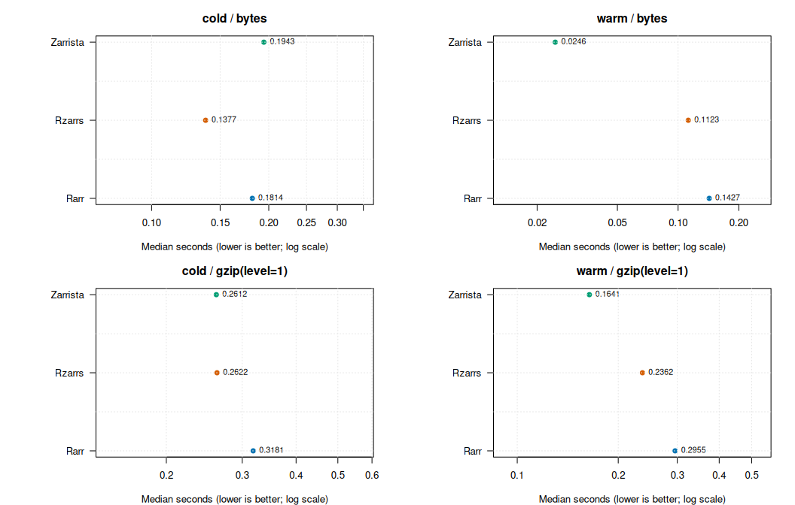
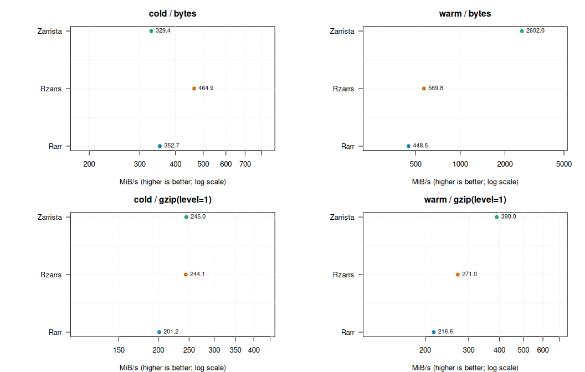
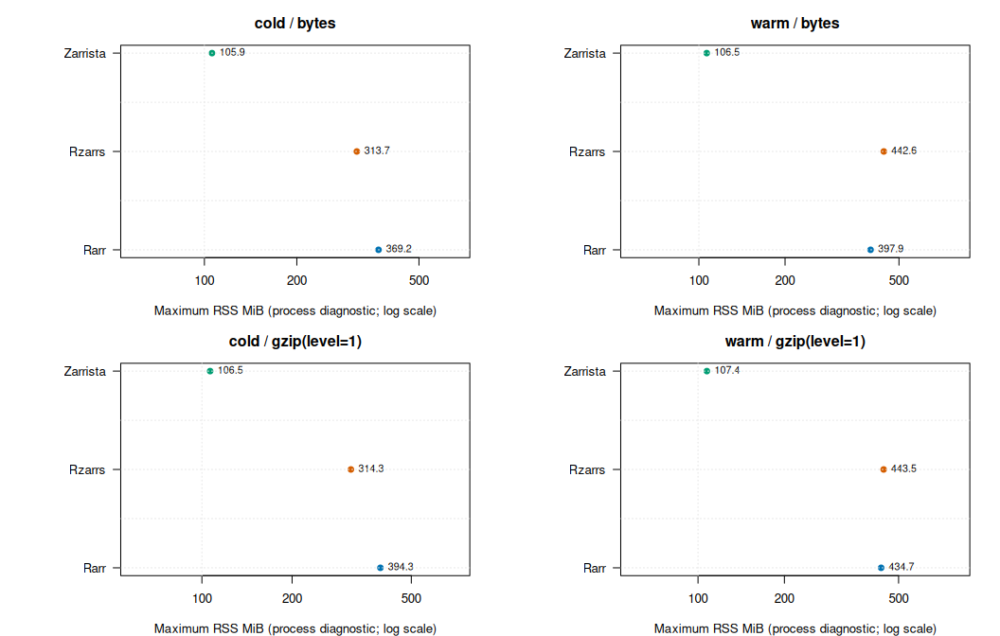

Rzarrs versus Rarr: numeric Zarr read benchmark
================

- [Scope](#scope)
- [Method](#method)
- [Recorded environment](#recorded-environment)
- [Results](#results)
- [Zarrista context baseline](#zarrista-context-baseline)
- [Visual comparisons](#visual-comparisons)
- [Network-bounded S3 matrix](#network-bounded-s3-matrix)
- [Compilation provenance and controlled rebuild
  gate](#compilation-provenance-and-controlled-rebuild-gate)
- [Interpretation limits](#interpretation-limits)

## Scope

This report measures Rzarrs after removing the eager materialization
path’s redundant full-array reorder buffer and per-element coordinate
allocation. It compares the common, validated surface only: a complete
local Zarr V3 `int32` array read into R. Deferred materialization,
ALTREP, and asynchronous APIs remain separate decisions.

The fixture generator makes two equivalent workloads:

- `numeric-uncompressed.zarr` uses only the bytes codec;
- `numeric-gzip.zarr` adds gzip level 1 after bytes.

The runner verifies bitwise-equivalent dimensions and values from Rzarrs
and Rarr before measuring either implementation. Zarr-VCF, ZIP stores,
strings, partial reads, transpose, and remote object stores are outside
this baseline. They require their own interoperable fixture and equality
contract.

Zarrista is included as a separate contextual point using the same
fixtures, CPU/NUMA placement, and thread limits. It materializes a
Python/NumPy array, not an R array, so it must never be read as an
R-binding comparison or folded into the Rzarrs-versus-Rarr speedup.

## Method

The driver uses `bench::mark()` for per-process elapsed-time and
allocation measurements. Package loading occurs before `bench::mark()`;
Zarrista likewise imports its Python API before `time.perf_counter()`
starts. Thus `median_s` measures a meaningful request—open the
store/array and fully materialize its payload—not R/Python process or
library startup. GNU `time -v` deliberately remains process-inclusive,
but is used only for peak RSS and CPU diagnostics, not the elapsed-time
denominator. Each implementation runs in a separate, fresh process. The
shell runner binds that process to one physical CPU and its NUMA memory
node with `taskset` and `numactl`, records GNU `time -v`, and alternates
tool order by replicate.

The baseline is deliberately single-threaded. Neither implementation has
a matched documented read-thread knob, so a multi-core taskset would not
establish equivalent thread budgets. The runner additionally pins
`BLOSC_NTHREADS`, `RAYON_NUM_THREADS`, `TOKIO_WORKER_THREADS`, and
OpenMP/BLAS thread variables to one; their exact values are recorded in
`environment.txt`. The Zarrista runner also sets `RAYON_NUM_THREADS=1`,
and records its exact upstream Git revision and Python environment. Warm
and cold cache data are distinct workloads and must never be pooled.

``` sh
Rscript benchmarks/make_benchmark_fixtures.R \
  --out "$HOME/.cache/Rzarrs/benchmarks/fixtures"

benchmarks/run_rzarrs_rarr_bench.sh \
  --fixtures "$HOME/.cache/Rzarrs/benchmarks/fixtures" \
  --out "$HOME/.cache/Rzarrs/benchmarks/results" \
  --cpuset 2 --numa-node 0 --mode warm --reps 5 --iterations 5

sudo benchmarks/run_rzarrs_rarr_bench.sh \
  --fixtures "$HOME/.cache/Rzarrs/benchmarks/fixtures" \
  --out "$HOME/.cache/Rzarrs/benchmarks/results" \
  --cpuset 2 --numa-node 0 --mode cold --reps 5

# ZARRISTA_PYTHON has zarrista + numpy installed from ZARRISTA_REVISION.
benchmarks/run_zarrista_bench.sh \
  --fixtures "$HOME/.cache/Rzarrs/benchmarks/fixtures" \
  --out "$HOME/.cache/Rzarrs/benchmarks/results" \
  --python "$ZARRISTA_PYTHON" --zarrista-revision "$ZARRISTA_REVISION" \
  --cpuset 2 --numa-node 0 --mode warm --reps 5 --iterations 5

RZARRS_BENCH_RESULTS="$HOME/.cache/Rzarrs/benchmarks/results" \
  Rscript -e 'rmarkdown::render("benchmarks/benchmark_rzarrs_rarr.Rmd")'
```

## Recorded environment

Every run directory contains `bench.rds`, `summary.csv`, GNU `time -v`
output, the exact command line, R session information, and its fixture
manifest. Each cache-mode directory has `environment.txt`, including
source revision/status, CPU and NUMA topology, package versions, and run
configuration. The report below only aggregates artifacts that share
this result directory.

``` r
read_time_v <- function(path) {
  lines <- readLines(path, warn = FALSE)
  rss_line <- grep("Maximum resident set size", lines, value = TRUE)
  cpu_line <- grep("Percent of CPU this job got", lines, value = TRUE)
  stopifnot(length(rss_line) == 1L, length(cpu_line) == 1L)
  rss_kib <- as.numeric(sub(".*: *", "", rss_line[[1L]]))
  cpu_percent <- as.numeric(sub("%.*", "", sub(".*: *", "", cpu_line[[1L]])))
  stopifnot(!is.na(rss_kib), !is.na(cpu_percent))
  c(max_rss_mib = rss_kib / 1024, cpu_percent = cpu_percent)
}

read_manifest <- function(path) {
  manifest <- file.path(dirname(path), "fixture.dcf")
  lines <- trimws(readLines(manifest, warn = FALSE))
  pairs <- regmatches(lines, regexec("^([^:=]+)[:=] *(.*)$", lines))
  stopifnot(all(lengths(pairs) == 3L))
  fields <- stats::setNames(
    vapply(pairs, `[[`, character(1L), 3L),
    vapply(pairs, `[[`, character(1L), 2L)
  )
  values <- c(
    logical_bytes = as.numeric(fields[["logical_bytes"]]),
    codec = unname(fields[["codec"]])
  )
  stopifnot(!anyNA(values), nzchar(values[["codec"]]))
  values
}

common_fields <- c(
  "implementation", "runtime", "runtime_version", "implementation_version",
  "benchmark_engine", "benchmark_engine_version", "measurement_scope",
  "startup_included", "mode", "store", "iterations_requested",
  "iterations_completed", "min_s", "median_s", "mean_s", "total_s"
)
summary_paths <- list.files(
  results_dir, pattern = "summary\\.csv$", recursive = TRUE, full.names = TRUE
)
stopifnot(length(summary_paths) > 0L)
raw_runs <- lapply(summary_paths, utils::read.csv, stringsAsFactors = FALSE)
stopifnot(all(vapply(
  raw_runs,
  function(result) nrow(result) == 1L && all(common_fields %in% names(result)),
  logical(1L)
)))

read_run <- function(result, path) {
  result <- result[common_fields]
  result$run_dir <- dirname(path)
  result$fixture <- basename(result$store)
  manifest <- read_manifest(path)
  result$logical_bytes <- as.numeric(manifest[["logical_bytes"]])
  result$codec <- manifest[["codec"]]
  resources <- read_time_v(file.path(result$run_dir, "time-v.txt"))
  result$max_rss_mib <- resources[["max_rss_mib"]]
  result$cpu_percent <- resources[["cpu_percent"]]
  result
}

runs <- do.call(rbind, Map(read_run, raw_runs, summary_paths))
runs$throughput_mib_s <- runs$logical_bytes / runs$median_s / 1024^2
stopifnot(
  !anyNA(runs),
  setequal(unique(runs$implementation), c("Rarr", "Rzarrs", "Zarrista"))
)

runtime_metric_paths <- list.files(
  results_dir, pattern = "^runtime-metrics\\.csv$", recursive = TRUE,
  full.names = TRUE
)
raw_runtime_metrics <- lapply(
  runtime_metric_paths, utils::read.csv, stringsAsFactors = FALSE
)
runtime_metric_fields <- c(
  "implementation", "runtime", "mem_alloc_bytes", "gc_count"
)
stopifnot(
  length(runtime_metric_paths) == sum(runs$runtime == "R"),
  all(vapply(
    raw_runtime_metrics,
    function(result) {
      nrow(result) == 1L && all(runtime_metric_fields %in% names(result))
    },
    logical(1L)
  ))
)
runtime_metrics <- do.call(rbind, Map(
  function(result, path) {
    result <- result[runtime_metric_fields]
    result$run_dir <- dirname(path)
    result
  },
  raw_runtime_metrics,
  runtime_metric_paths
))
r_runs <- merge(
  subset(runs, runtime == "R"), runtime_metrics,
  by = c("run_dir", "implementation", "runtime"), sort = FALSE
)
zarrista_runs <- subset(runs, implementation == "Zarrista")
stopifnot(!anyNA(r_runs), nrow(r_runs) == sum(runs$runtime == "R"))
```

``` r
environment_paths <- list.files(
  results_dir, pattern = "^environment\\.txt$", recursive = TRUE, full.names = TRUE
)
stopifnot(length(environment_paths) > 0L)
environment_receipts <- data.frame(
  receipt = substring(environment_paths, nchar(results_dir) + 2L)
)
knitr::kable(environment_receipts, row.names = FALSE)
```

| receipt                       |
|:------------------------------|
| cold/environment.txt          |
| cold/zarrista/environment.txt |
| warm/environment.txt          |
| warm/zarrista/environment.txt |

## Results

`bench` repeats inside a process. The table therefore reports the median
of each process’s `bench` median across process-level replicates.
`max_rss_mib` and `cpu_percent` are likewise process-level medians from
GNU `time -v`.

``` r
reported <- stats::aggregate(
  runs[c("median_s", "mean_s", "throughput_mib_s", "max_rss_mib", "cpu_percent")],
  by = list(
    mode = runs$mode,
    fixture = runs$fixture,
    codec = runs$codec,
    implementation = runs$implementation,
    runtime = runs$runtime
  ),
  FUN = stats::median
)
for (field in c(
  "median_s", "mean_s", "throughput_mib_s", "max_rss_mib", "cpu_percent"
)) {
  reported[[field]] <- signif(reported[[field]], 5)
}
knitr::kable(reported, row.names = FALSE)
```

| mode | fixture                   | codec         | implementation | runtime | median_s |   mean_s | throughput_mib_s | max_rss_mib | cpu_percent |
|:-----|:--------------------------|:--------------|:---------------|:--------|---------:|---------:|-----------------:|------------:|------------:|
| cold | numeric-uncompressed.zarr | bytes         | Zarrista       | Python  | 0.194290 | 0.194290 |           329.40 |      105.88 |          52 |
| warm | numeric-uncompressed.zarr | bytes         | Zarrista       | Python  | 0.024598 | 0.024811 |          2601.90 |      106.52 |         100 |
| cold | numeric-gzip.zarr         | gzip(level=1) | Zarrista       | Python  | 0.261200 | 0.261200 |           245.03 |      106.52 |          73 |
| warm | numeric-gzip.zarr         | gzip(level=1) | Zarrista       | Python  | 0.164090 | 0.164600 |           390.04 |      107.38 |          99 |
| cold | numeric-uncompressed.zarr | bytes         | Rarr           | R       | 0.181430 | 0.181430 |           352.75 |      369.16 |          87 |
| warm | numeric-uncompressed.zarr | bytes         | Rarr           | R       | 0.142700 | 0.144050 |           448.50 |      397.87 |          99 |
| cold | numeric-gzip.zarr         | gzip(level=1) | Rarr           | R       | 0.318080 | 0.318080 |           201.20 |      394.32 |          90 |
| warm | numeric-gzip.zarr         | gzip(level=1) | Rarr           | R       | 0.295520 | 0.295200 |           216.56 |      434.73 |          99 |
| cold | numeric-uncompressed.zarr | bytes         | Rzarrs         | R       | 0.137660 | 0.137660 |           464.92 |      313.72 |          81 |
| warm | numeric-uncompressed.zarr | bytes         | Rzarrs         | R       | 0.112310 | 0.120950 |           569.83 |      442.63 |          99 |
| cold | numeric-gzip.zarr         | gzip(level=1) | Rzarrs         | R       | 0.262220 | 0.262220 |           244.07 |      314.32 |          88 |
| warm | numeric-gzip.zarr         | gzip(level=1) | Rzarrs         | R       | 0.236160 | 0.244490 |           271.00 |      443.54 |          99 |

R allocation and garbage-collection counts are runtime-specific
diagnostics, so they are reported separately rather than padded into
Python rows.

``` r
r_runtime_report <- stats::aggregate(
  r_runs[c("mem_alloc_bytes", "gc_count")],
  by = list(
    mode = r_runs$mode,
    fixture = r_runs$fixture,
    codec = r_runs$codec,
    implementation = r_runs$implementation
  ),
  FUN = stats::median
)
r_runtime_report$mem_alloc_mib <- signif(
  r_runtime_report$mem_alloc_bytes / 1024^2, 5
)
r_runtime_report$mem_alloc_bytes <- NULL
knitr::kable(r_runtime_report, row.names = FALSE)
```

| mode | fixture                   | codec         | implementation | gc_count | mem_alloc_mib |
|:-----|:--------------------------|:--------------|:---------------|---------:|--------------:|
| cold | numeric-uncompressed.zarr | bytes         | Rarr           |        5 |       321.570 |
| warm | numeric-uncompressed.zarr | bytes         | Rarr           |       19 |       320.650 |
| cold | numeric-gzip.zarr         | gzip(level=1) | Rarr           |        5 |       407.730 |
| warm | numeric-gzip.zarr         | gzip(level=1) | Rarr           |       28 |       406.800 |
| cold | numeric-uncompressed.zarr | bytes         | Rzarrs         |        1 |        64.087 |
| warm | numeric-uncompressed.zarr | bytes         | Rzarrs         |        4 |        64.034 |
| cold | numeric-gzip.zarr         | gzip(level=1) | Rzarrs         |        1 |        64.087 |
| warm | numeric-gzip.zarr         | gzip(level=1) | Rzarrs         |        4 |        64.034 |

A speedup is only meaningful within one `mode`, fixture, codec, CPU
binding, and environment. For each matched pair below, a value above 1
means Rzarrs had the lower process-level `bench` median.

``` r
per_run <- stats::aggregate(
  r_runs["median_s"],
  by = list(
    mode = r_runs$mode,
    fixture = r_runs$fixture,
    codec = r_runs$codec,
    implementation = r_runs$implementation
  ),
  FUN = stats::median
)
wide <- reshape(
  per_run,
  idvar = c("mode", "fixture", "codec"),
  timevar = "implementation",
  direction = "wide"
)
stopifnot(all(c("median_s.Rzarrs", "median_s.Rarr") %in% names(wide)))
wide$rzarrs_speedup_over_rarr <- wide$median_s.Rarr / wide$median_s.Rzarrs
wide$rzarrs_speedup_over_rarr <- signif(wide$rzarrs_speedup_over_rarr, 5)
knitr::kable(wide, row.names = FALSE)
```

| mode | fixture                   | codec         | median_s.Rarr | median_s.Rzarrs | rzarrs_speedup_over_rarr |
|:-----|:--------------------------|:--------------|--------------:|----------------:|-------------------------:|
| cold | numeric-uncompressed.zarr | bytes         |     0.1814320 |       0.1376574 |                   1.3180 |
| warm | numeric-uncompressed.zarr | bytes         |     0.1426969 |       0.1123149 |                   1.2705 |
| cold | numeric-gzip.zarr         | gzip(level=1) |     0.3180841 |       0.2622211 |                   1.2130 |
| warm | numeric-gzip.zarr         | gzip(level=1) |     0.2955242 |       0.2361595 |                   1.2514 |

## Zarrista context baseline

Zarrista runs the same local V3 fixtures with the same CPU/NUMA and
native thread controls, but its result is a NumPy array. The unified
timing and process-resource table includes Zarrista, while the R-only
runtime diagnostics remain separate. It is a comparison point for a
Rust-native Python reader, not a prospective R binding measurement.

## Visual comparisons

These plots include all three readers. Zarrista remains a Python/NumPy
context point; visual proximity is not an R-binding claim. The timed
operation is the loaded-runtime, open-and-materialize request recorded
in `measurement_scope`.

``` r
plot_runs <- runs[
  c("implementation", "mode", "codec", "median_s", "throughput_mib_s", "max_rss_mib")
]
plot_runs$workload <- paste(plot_runs$mode, plot_runs$codec, sep = " / ")
summary_runs <- stats::aggregate(
  plot_runs[c("median_s", "throughput_mib_s", "max_rss_mib")],
  by = list(
    implementation = plot_runs$implementation,
    workload = plot_runs$workload
  ),
  FUN = stats::median
)
implementations <- c("Rarr", "Rzarrs", "Zarrista")
workloads <- c(
  "cold / bytes", "warm / bytes", "cold / gzip(level=1)",
  "warm / gzip(level=1)"
)
colours <- c(Rarr = "#0072B2", Rzarrs = "#D55E00", Zarrista = "#009E73")

draw_metric <- function(metric, label) {
  old <- par(mfrow = c(2, 2), mar = c(4, 8, 3, 2))
  on.exit(par(old), add = TRUE)
  for (workload in workloads) {
    values <- summary_runs[
      summary_runs$workload == workload, c("implementation", metric)
    ]
    values <- values[match(implementations, values$implementation), ]
    stopifnot(nrow(values) == length(implementations), !anyNA(values))
    x <- values[[metric]]
    pad <- c(min(x) / 1.8, max(x) * 1.8)
    plot(
      x, seq_along(x), log = "x", xlim = pad, yaxt = "n", pch = 19,
      col = colours[values$implementation], xlab = label, ylab = "",
      main = workload
    )
    axis(2, at = seq_along(x), labels = values$implementation, las = 1)
    text(
      x, seq_along(x), labels = format(signif(x, 4), trim = TRUE),
      pos = 4, cex = 0.8
    )
    grid(col = "grey90")
  }
}

draw_metric("median_s", "Median seconds (lower is better; log scale)")
```

<!-- -->

``` r
draw_metric("throughput_mib_s", "MiB/s (higher is better; log scale)")
```

<!-- -->

``` r
draw_metric("max_rss_mib", "Maximum RSS MiB (process diagnostic; log scale)")
```

<!-- -->

## Network-bounded S3 matrix

The local-store table above is not a network result. The remote version
is a separate S3-compatible workload: stage the immutable fixture once
into a local MinIO bucket, run each client in a dedicated network
namespace, and apply the same `tc netem` rate and latency in both
directions on its veth pair. Record MinIO revision, bucket/prefix,
object count/bytes, endpoint, latency, rate, page-cache mode, and client
thread limits. Do not use an unbounded public endpoint or fold local and
remote results together.

It is gated on a successful equivalent full-array remote probe for all
three clients: Rarr through its explicit `s3_client`, Rzarrs through
`ZarrObjectStore`, and Zarrista through an Obstore S3 store. Until that
probe is executable and equality-checked, the report must say that an
all-three network comparison is unavailable rather than presenting a
two-reader result as equivalent.

## Compilation provenance and controlled rebuild gate

The environment receipts record toolchains, binary hashes, and
build-affecting environment variables. They identify what ran, but
compiler identity alone does **not** prove flag parity—especially for an
already-installed Rarr binary. Do not attribute the observed difference
to library design until the controlled rebuild campaign below reproduces
it.

1.  Build Rarr and Rzarrs from source in a clean R environment with no
    user or site Makevars overrides; save every compile and link
    command.
2.  Pin and record the Rust toolchain, Cargo release profile, C/C++
    compiler, C/C++ flags, linker flags, enabled features, and binary
    SHA-256 hashes.
3.  Re-run this exact fixture, CPU/NUMA/thread/cache matrix on those
    artifacts.
4.  Report both the installed-artifact and controlled-rebuild tables;
    only a stable gap across them rules out unknown compilation flags as
    the cause.

## Interpretation limits

This report attributes no cost by itself. The difference between
bytes-only and gzip fixtures estimates the combined codec contribution
for this workload, not compression time in isolation. Profiling comes
next only if the measured result makes an extension worthwhile; it must
distinguish I/O, decompression, data layout conversion, and R object
materialization.
